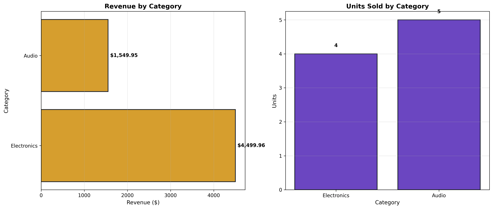
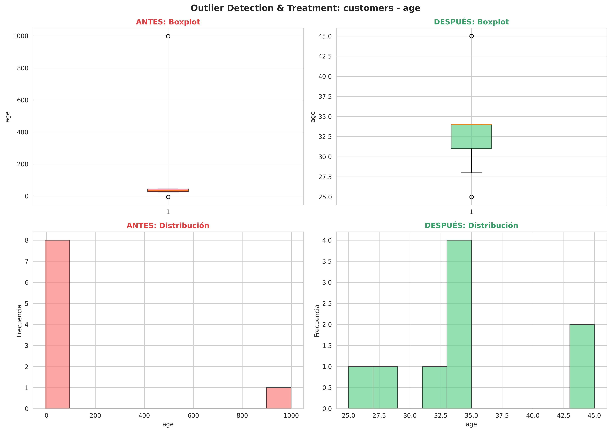
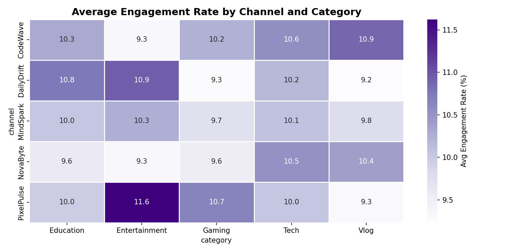
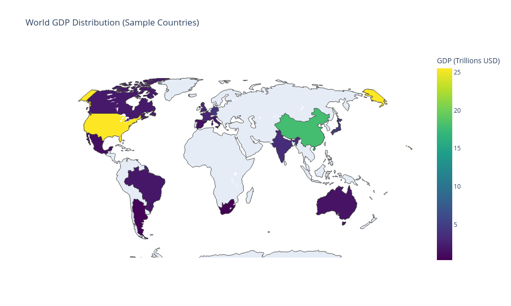

# Data Insights & Visual Analytics Portfolio

Este repositorio compila una serie de proyectos y actividades enfocadas en el ciclo de vida del dato: desde la persistencia en bases de datos relacionales hasta la generación de visualizaciones avanzadas para la toma de decisiones.

## 🚀 Secciones del Proyecto

### 📂 01. SQL Database Systems
Enfoque en la arquitectura de datos y operaciones CRUD utilizando tecnologías de contenedorización y motores relacionales.
*   **Tecnologías:** Docker, Docker-Compose, MySQL, PostgreSQL.
*   **Key Features:** Implementación de transacciones, scripts de inicialización de esquemas y conexión mediante Python para la gestión de datos.
> **Evidencia de ejecución SQL:**
> 

### 📂 02. Data Quality and Wrangling
Procesos críticos de limpieza y transformación de datos para asegurar la integridad de los análisis.
*   **Tecnologías:** Python, Pandas, NumPy.
*   **Key Features:** 
    *   **Data Standardization:** Normalización de categorías y formatos.
    *   **Missing Data Handling:** Técnicas de imputación y remoción de nulos.
    *   **Deduplication:** Identificación y eliminación de registros redundantes.
> **Análisis de Calidad:**
> 

### 📂 03. Visual Analytics Gallery
Exploración visual avanzada para descubrir patrones y tendencias ocultas en los datasets.
*   **Tecnologías:** Plotly, Matplotlib, Seaborn, Jupyter Notebooks.
*   **Key Features:** Visualizaciones interactivas y estáticas de alta fidelidad.
### 🎨 Galería Destacada
| Análisis de Engagement | Distribución Geoespacial |
| :---: | :---: |
|  |  |

---

## 📊 Visual Insights

Este portafolio destaca por la implementación de técnicas estadísticas aplicadas a la visualización:

*   **Mapas Coropléticos:** Análisis geoespacial para la densidad de métricas por región.
*   **Detección de Outliers:** Identificación de anomalías mediante diagramas de caja (Boxplots) y análisis de dispersión para mejorar la calidad del modelo de datos.
*   **Análisis de Tendencias:** Visualización de series temporales y engagement por categorías.

---

## 🛠️ Requisitos
*   Python 3.10+
*   Docker & Docker-Compose
*   Librerías: `pandas`, `plotly`, `sqlalchemy`, `matplotlib`

---
*Desarrollado como parte del programa de Visualización de Datos.*
